# tiendatuya.com


<b>tiendatuya.com</b> es una plataforma de e-commerce para implementación de tiendas en línea para pequeños comercios que necesitan sumar un canal digital a su punto de venta físico o tradicional.

## Licencia
Freemium y compras dentro de la aplicación.<br>
Contacto comercial: Sergio Becerra, 351 595-1004.

## Instalación
Instruciones para instalar y configurar el proyecto en forma local.

```bash
git clone https://github.com/sergioibecerra/ProyectoFinal-Becerra.git entrega-3
cd entrega-3
npm install
```

Para la ejecución local, desde la carpeta del proyecto, ejecutar:
```bash
npm run dev
```

Dependencias utilizadas:
- firebase      ver 12.4.0
- react         ver 19.1.1
- react-dom     ver 19.1.1
- react-router  ver 7.9.5

## Características

- Fácil de instalar.
- Interfaz amigable.
- Integrable con los principales ERP del mercado (próximamente).

## Capturas de pantalla

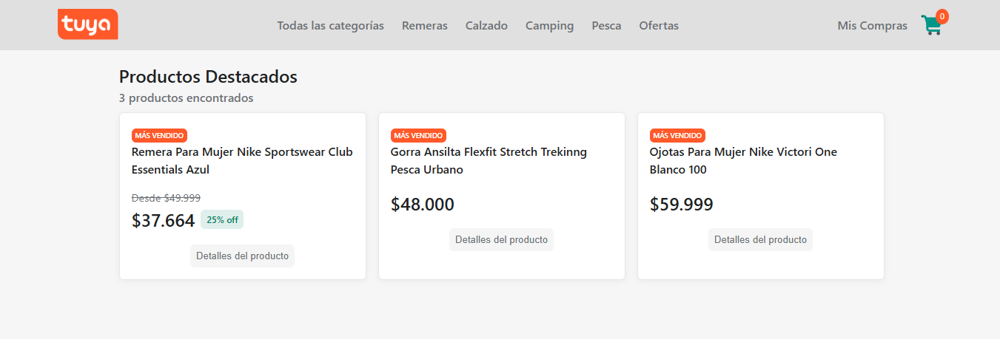

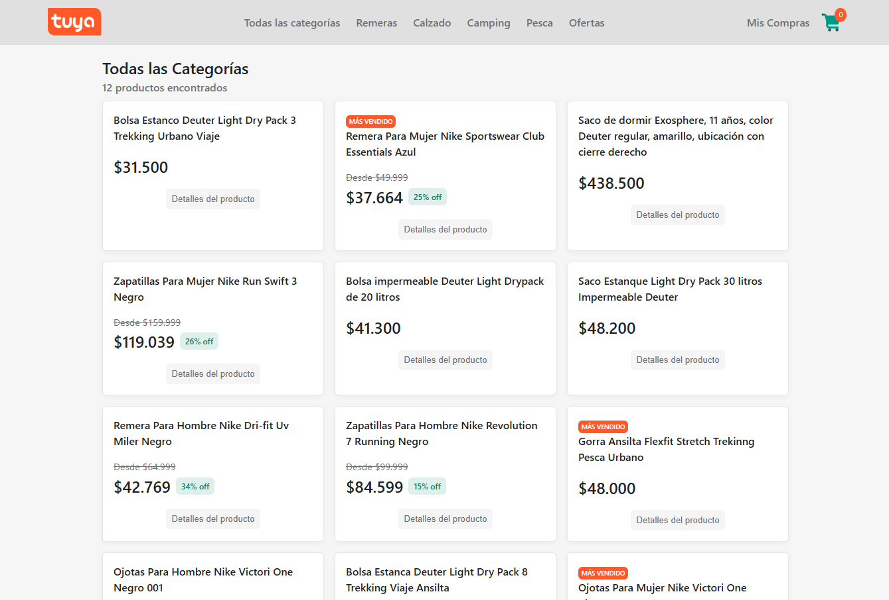


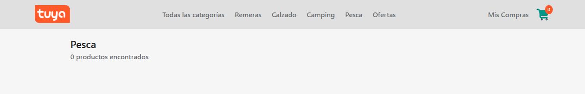

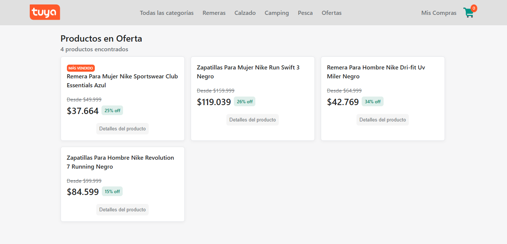

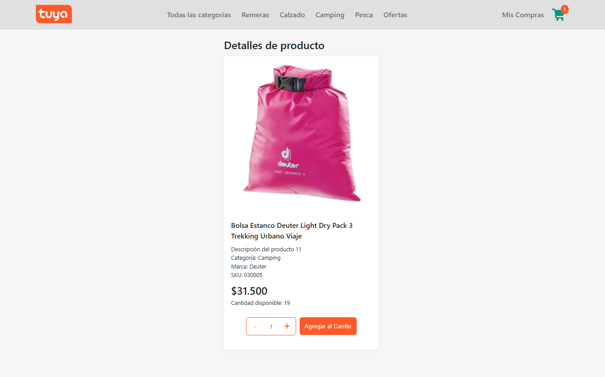

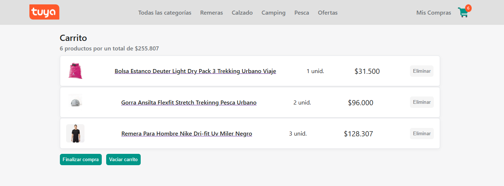

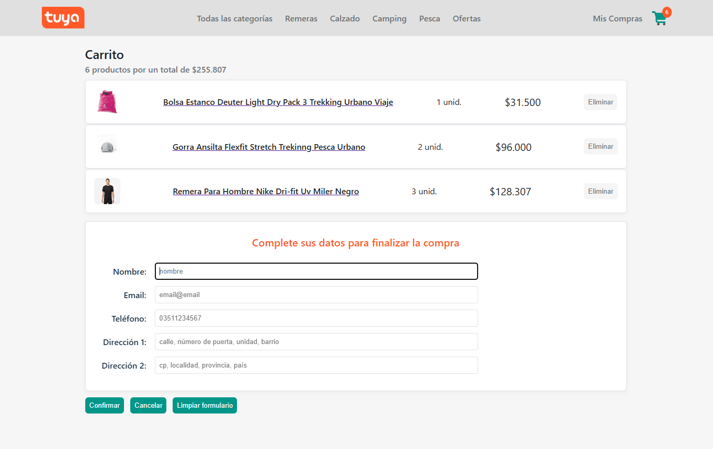

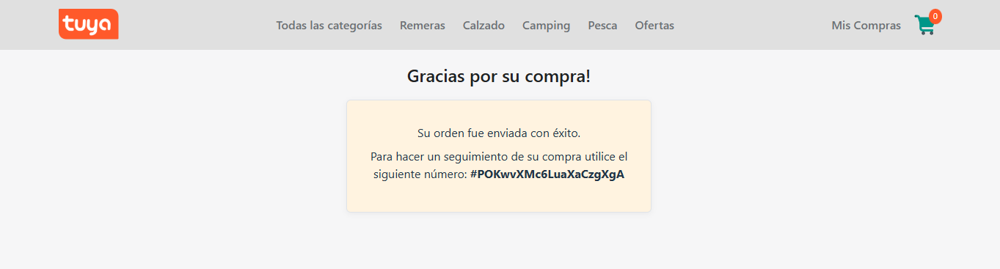

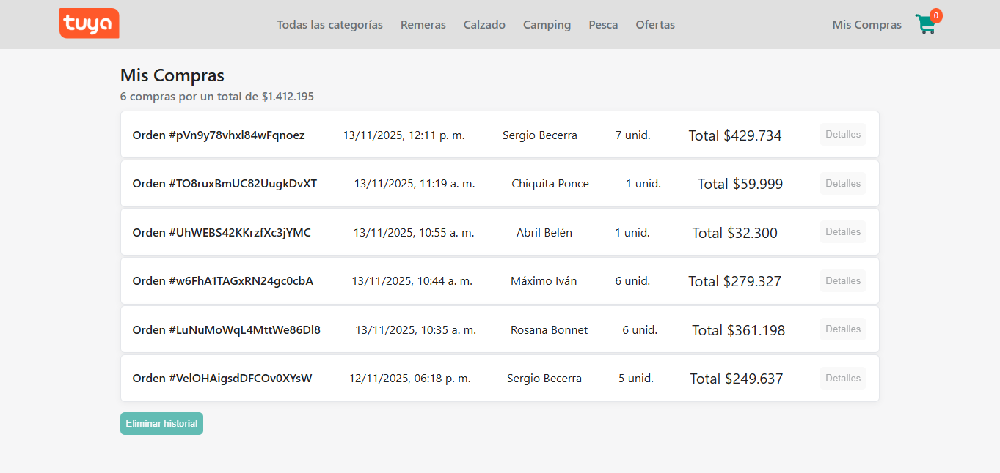

## Enlaces

- [Acceso a versión hosteada en Vercel](https://proyecto-final-becerra.vercel.app/)

# Funcionalidades del sitio

## Sección "Listado de productos"
Esta sección lista el catálogo de productos, que consituyen la oferta del sitio. Para facilitar el acceso a los distintos productos, el sitio los organiza en grupos de presentación según los siguientes filtros:

- Filtro <b>"Productos destacados"</b>: Al hacer Click en el Home del sitio (logo Tienda Tuya) se listan los productos destacados como "Más Vendidos" del sitio (columna "featured" = a true).
- Filtro <b>"Todas las categorías"</b>: Al hacer Click en la opción "Todas las categorías" de la barra de navegación se listan todos los productos del catálogo.
- Filtro <b>"<Categoría NNN>"</b>: Al hacer Click en una de las categorías listadas en la barra de navegación, se listan todos los productos que pertenecen a esa categoría.
- Filtro <b>"Productos en oferta"</b>: Al hacer Click en la opción "Ofertas" de la barra de navegación se listan todos los productos que están en oferta (descuento).

**Consideraciones:**<br>
- Al seleccionar listar los productos de "Todas las categorías" (maestro de productos sin filtros), si se detecta que no hay productos en la BD, se activa la función de carga en FireStore de los productos registrados en el archivo <b>data.js</b>. Luego de cargado todos los productos, se desactiva el acceso a esta funcionalidad. La siguiente secuencia representa la operatoria:

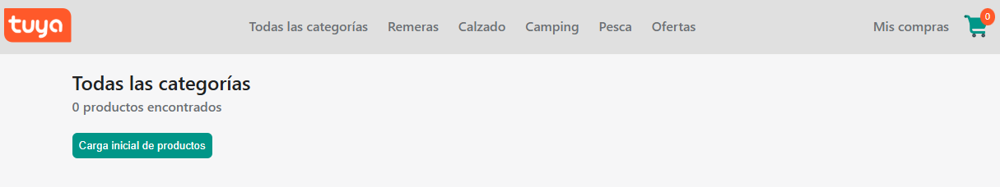


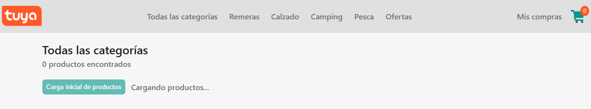

- Se creó en FireStore la colección "categories" para obtener las descripciones de las categorías seleccionadas para filtrar y poder mostrarlo en el listado:

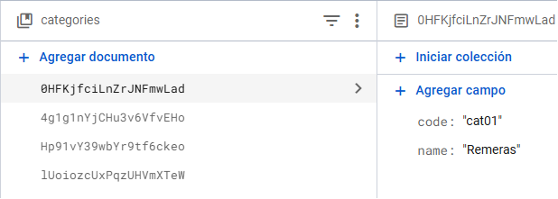

- Al reemplazarse los ID de Productos y Categorías de un valor numérico manual como originalmente estaba en el archivo data.js, a uno autogenerado por FireStore, es que migré el campo categoryId por categoryCode, para poder dejarlo fijo en las llamadas a las rutas de listado de productos por categoría, por lo que también cambié el manejo de parámetro en la ruta de "/category/:categoryId" por "/categoty/search", pasando la llamada de ser por ejemplo: "/category/cat01" a "/category/search?categoryCode=cat01", de esta forma lo trato como un parámetro de búsqueda sobre una clave alrternativa que es el  categoryCode" en vez del parámetro en ruta que era la clave primaria "categoryId"


**Componentes involucrados:**<br>
ItemListContainer<br>
&nbsp;&nbsp;└─ ItemList<br>

## Sección "Detalles de producto"
Esta sección muestra los atributos de un producto, pertinentes para el proceso de conversión de compra, y a su vez permite agregarlo al carrito de compras.

- Muestra cuando el artículo tiene la marca de "featured" (Más Vendido).
- En caso de tener un descuento (price distinto a basePrice), muestra el mismo en formato de oferta.
- Muestra la cantidad de unidades del producto disponible para la compra. Este disponible se actualiza en línea en la medida en que sus unidades son agregadas al carrito de compras.
- Permite seleccionar una cantidad de unidades a agregar al carrito, entre 1 y la cantidad disponible en el momento (valida estos límites).
- Cuando se alcanza la cantidad de unidades disponibles agregadas al carrito, en el detalle del producto puede verse una advertencia de "Producto sin Stock".

**Componentes involucrados:**<br>
ItemDetailContainer<br>
&nbsp;&nbsp;└─ ItemDetail<br>
&nbsp;&nbsp;&nbsp;&nbsp;&nbsp;&nbsp;&nbsp;&nbsp;&nbsp;&nbsp;└─ ItemCount<br>

## Sección "Carrito"
Esta sección muestra en forma de listado los productos, y sus cantidades, seleccionados para la compra.

- Haciendo Click en el título de un producto navegamos a la sección "Detalles de producto".
- Haciendo Click en el botón "Eliminar" de un producto, quitamos el mismo de la lista de productos seleccionados.
- Haciendo Click en el botón "Finalizar compra", desplegamos el formulario de carga de los datos personales del comprador para poder luego confirmar la compra. Para proceder con la compra, hacemos Click en el botón "Confirmar", se nos solicitará una segunda confirmación, y luego de enviada la compra nos mostrará un mensaje con el número con la que esta orden fué creada.

**Consideraciones:**<br>
Me quedé sin energía en la "última milla" y no armé un estilo para distribuír / alinear adecuadamente el contenido de cada ítem del carrito listado.

**Componentes involucrados:**<br>
CartContainer<br>
&nbsp;&nbsp;└─ CartItem<br>

## Sección "Mis compras"
Esta sección muestra un listado histórico de las compras realizadas.

**Consideraciones:**<br>
- Queda pendiente como mejora futura la implementación de la visualización del detalle de cada orden de compra creada, como así también la posibilidad de eliminar la historia de compras (esta acción tiene sentido en el contexto de que con la creación de cada orden se descontara del stock del producto las cantidades involucradas, y luego al eliminar el historial de compras, este stock disponible se restituiría - siempre en un contexto de Demo).
- Me quedé sin energía en la "última milla" y no armé un estilo para distribuír / alinear adecuadamente el contenido de cada orden listada.

**Componentes involucrados:**<br>
OrderListContainer<br>
&nbsp;&nbsp;└─ OrderList<br>

